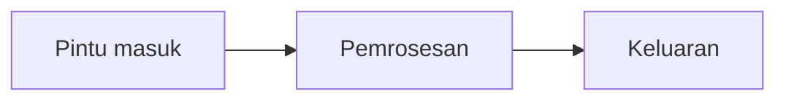

---
tags:
  - type/reference
  - division/product
  - theme/produk
type: reference
division: product
produk: ""
slug: ""
lini: ""
status_produk: ""
domain: ""
terverifikasi: ""
repo: []
pemilik: ""
publish_safe: false
konten_layak: false
konten_pilar: ""
konten_status: "belum"
pembeli: ""
model_bisnis: ""
harga: ""
date_created: ""
date_updated: ""
sources:
  - "unverified"
lead: ""
template-type: Product Doc
template-version: "2.0"
---

# Nama produk

> Satu kalimat: produk ini bikin siapa bisa melakukan apa.
> Ditulis untuk orang luar. Kalau belum bisa satu kalimat tanpa istilah internal,
> produknya belum jelas — itu temuan, bukan kegagalan.

## Untuk siapa

Siapa yang memakai, dan masalah apa yang hilang setelah dia pakai ini.

## Apa yang dilakukan

Kemampuan, bukan daftar endpoint.

- Kemampuan pertama
- Kemampuan kedua

## Yang TIDAK dilakukan

Batas yang eksplisit. Ini yang mencegah janji berlebihan saat demo.

- Tidak melakukan X
- Belum mendukung Y

## Cara memakainya

1. Langkah pertama
2. Langkah kedua

## Cara kerjanya

## Bukti hidup

| | |
|---|---|
| Alamat | |
| Status terakhir | |
| Cara memverifikasi | |

## Riwayat perubahan

Tiap baris baru di sini adalah satu calon konten "Baru di [produk]".

| Tanggal | Yang berubah |
|---|---|
| | |

---

<!-- INTERNAL — DIBUANG SAAT PUBLIKASI -->

## Internal

### Harga dan cara jual

| | |
|---|---|
| Model | |
| Harga | |
| Yang dibutuhkan untuk mengirim | |

### Ketergantungan

| Bergantung pada | Kalau rusak | Punya kita? |
|---|---|---|
| | | |

### Yang belum terjawab

-

### Riwayat keputusan

| Tanggal | Keputusan | Alasan |
|---|---|---|
| | | |
